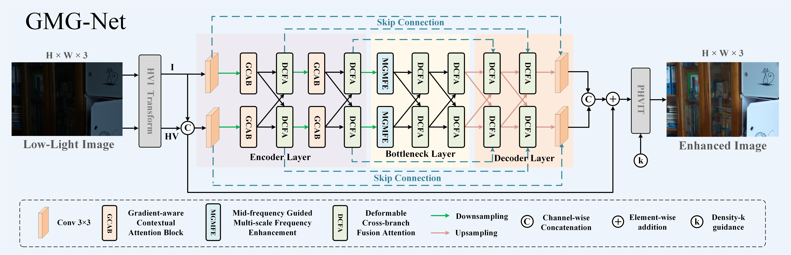
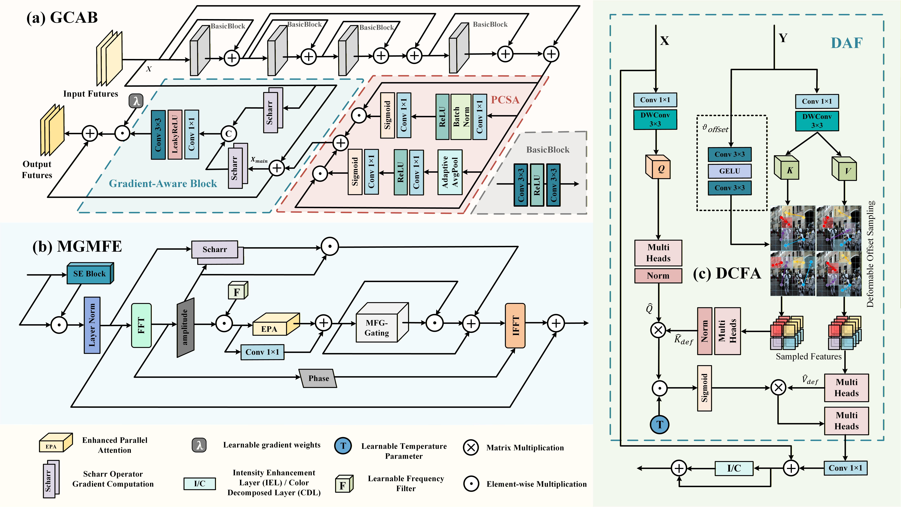
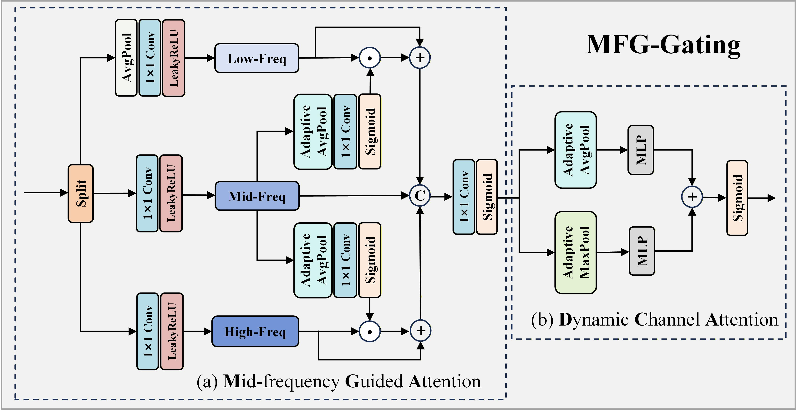
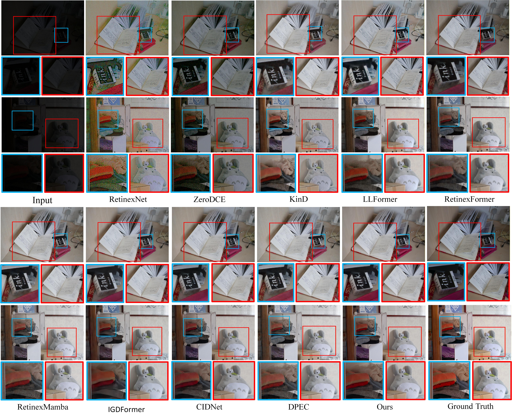
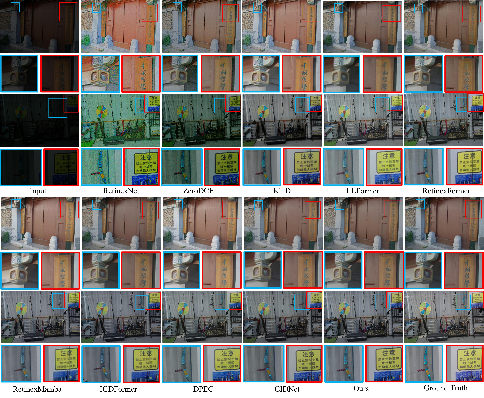
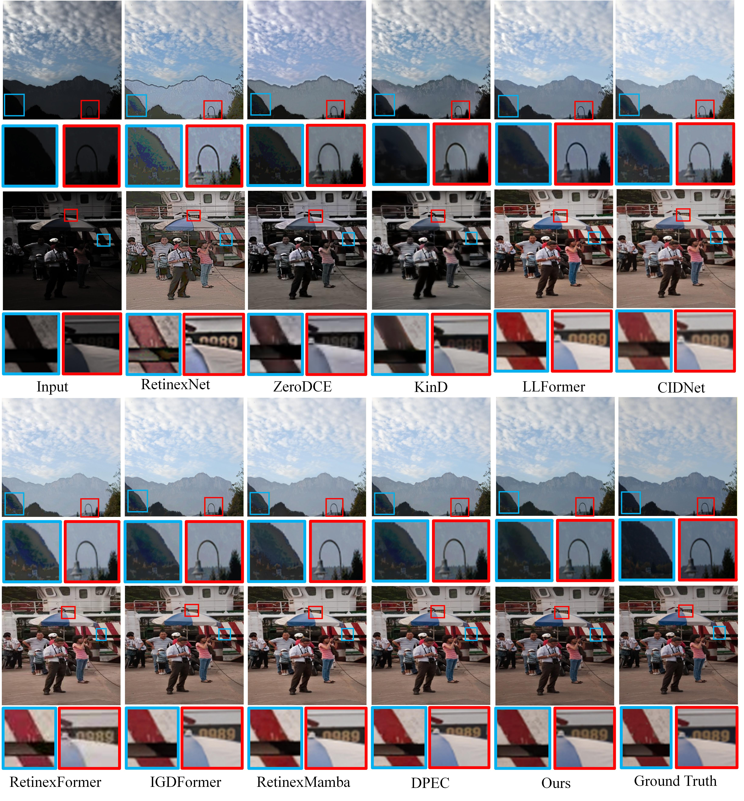
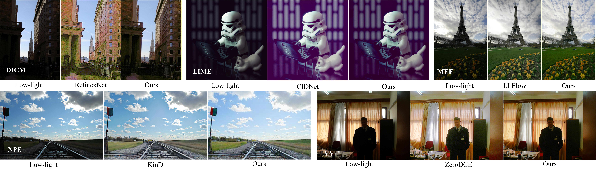
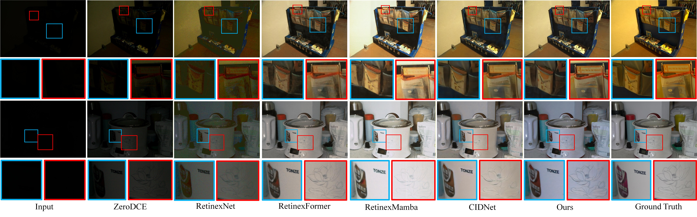

# [KBS2026] GMG-Net: Gradient-aware and Mid-frequency Guided Network for Low-light Image Enhancement

<p align="center">
  <a href="https://doi.org/10.1016/j.knosys.2026.116390">
    
  </a>
  <a href="https://www.sciencedirect.com/science/article/pii/S0950705126011160">
    
  </a>
  <a href="https://github.com/Century-lu/GMG-Net">
    
  </a>
  
  
</p>

This repository contains the official implementation of **GMG-Net: Gradient-aware and Mid-frequency Guided network for low-light image enhancement**, published in **Knowledge-Based Systems**.

**Authors:** Huaping Zhou [](https://orcid.org/0000-0002-4419-0825), Shiji Lu [](https://orcid.org/0009-0001-9871-6001), Kelei Sun [](https://orcid.org/0000-0002-3966-2031), Tao Wu [](https://orcid.org/0000-0002-3915-4977), Bin Deng, and Man Chen

**Paper:** [ScienceDirect](https://www.sciencedirect.com/science/article/pii/S0950705126011160) | [DOI](https://doi.org/10.1016/j.knosys.2026.116390)

## News

- **2026.06.08:** The paper is available online in *Knowledge-Based Systems*.
- **2026.06.03:** GMG-Net is accepted by *Knowledge-Based Systems*.
- Code and evaluation scripts will be released in this repository.

## 1. Abstract

Low-light image enhancement is a challenging task in image processing, aiming to restore visually natural and structurally faithful images from environments with insufficient and spatially varying illumination. Although mainstream deep learning methods have achieved notable progress, they often fail to adaptively handle regions with varying lighting conditions in scenes with large illumination changes, resulting in noise amplification, detail degradation, and color distortion. To address these issues, we propose GMG-Net, a low-light enhancement network based on a gradient-aware mechanism and a mid-frequency guided mechanism. First, we design a Gradient-aware Contextual Attention Block (GCAB). This block dynamically enhances blurred edge features in low-light images through a gradient-aware mechanism, preserving regions with clear structural information. Second, we propose a Mid-frequency Guided Multi-scale Frequency Enhancement Module (MGMFE). It uses informative mid-frequency features as guidance to adaptively modulate high- and low-frequency information 
in the frequency domain. Third, we develop a Deformable Cross-branch Fusion Attention (DCFA) module. It dynamically aligns and fuses features between the HV-branch and I-branch within the HVI color space using deformable offset sampling. Experiments on the multiple datasets demonstrate that GMG-Net exhibits good visual and performance advantages in low-light image enhancement. Additionally, our method maintains low Params and FLOPs, making it suitable for practical applications.

## 2. Proposed GMG-Net

### Overall Framework

<p align="center">
  
</p>


### Main Components

<details>
<summary><b>Components (click to expand)</b></summary>

<p align="center">
  
</p>

<p align="center">
  
</p>

</details>

## 3. Visual Results

<details>
<summary><b>LOL-v1, LOL-v2-real, and LOL-v2-synthetic:</b></summary>

<p align="center">
  
</p>

<p align="center">
  
</p>

<p align="center">
  
</p>

</details>

<details>
<summary><b>Unpaired real-world datasets</b></summary>

<p align="center">
  
</p>

</details>

<details>
<summary><b>Sony Total Dark</b></summary>

<p align="center">
  
</p>

</details>

## 4. Quantitative Results

<details>
<summary><b>Paired Benchmarks</b></summary>

The following table reports results both with and without the GT-Mean strategy.

| Dataset | PSNR | SSIM | LPIPS |
| --- | ---: | ---: | ---: |
| LOL-v1 | 24.741 | 0.866 | 0.083 |
| LOL-v1 (use GT Mean) | 27.976 | 0.880 | 0.078 |
| LOL-v2 Real | 23.696 | 0.871 | 0.109 |
| LOL-v2 Real (use GT Mean) | 28.296 | 0.891 | 0.105 |
| LOL-v2 Synthetic | 25.995 | 0.943 | 0.042 |
| LOL-v2 Synthetic (use GT Mean) | 29.994 | 0.953 | 0.037 |

</details>

<details>
<summary><b>Sony Total Dark</b></summary>

| Dataset | PSNR | SSIM | LPIPS |
| --- | ---: | ---: | ---: |
| Sony Total Dark | 22.552 | 0.677 | 0.449 |

</details>

<details>
<summary><b>Unpaired Real-world Benchmarks</b></summary>

NIQE and BRISQUE are no-reference metrics. Lower values indicate better perceptual naturalness.
The results on unpaired datasets are obtained by directly testing with weights trained on the LOL dataset.

| Metric | DICM | LIME | MEF | NPE | VV | Avg |
| --- | ---: | ---: | ---: | ---: | ---: | ---: |
| NIQE | 3.69 | 4.14 | 3.55 | 3.75 | 3.23 | 3.67 |
| BRISQUE | 28.09 | 18.45 | 14.54 | 19.45 | 29.56 | 22.02 |

</details>

<details>
<summary><b>Efficiency</b></summary>

Runtime is reported on an RTX 4090D with 256 x 256 input, averaged over 300 repetitions after 50 warmup iterations.

| Params (M) | FLOPs (G) | Runtime (ms) | FPS |
| ---: | ---: | ---: | ---: |
| 3.82 | 30.44 | 33.36 | 29.97 |

</details>

## 5. Citation

If you find our work useful for your research, please cite our paper:

```bibtex
@article{Lu2026GMG,
  title = {GMG-Net: Gradient-aware and Mid-frequency Guided network for low-light image enhancement},
  journal = {Knowledge-Based Systems},
  volume = {348},
  pages = {116390},
  year = {2026},
  issn = {0950-7051},
  doi = {https://doi.org/10.1016/j.knosys.2026.116390},
  url = {https://www.sciencedirect.com/science/article/pii/S0950705126011160},
  author = {Huaping Zhou and Shiji Lu and Kelei Sun and Tao Wu and Bin Deng and Man Chen},
}
```

## 6. License

This project is released under the license provided in `LICENSE`.

## 7. Contact

If you have any questions, please open an issue in this repository.

## 8. Acknowledgement

We thank the authors of public low-light image enhancement datasets and related open-source projects for their valuable contributions to the community.
